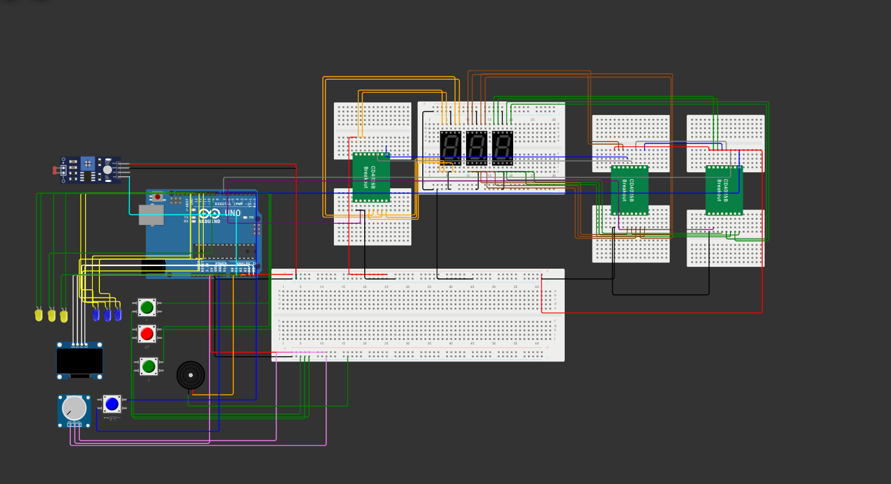

# 🚀 Spaceship Control Game – Embedded Real-Time Simulation

### 🎮 Overview

This project is a **real-time spaceship control game** developed on **Arduino Uno** using **Wokwi Simulator**.
It combines **embedded systems**, **game logic**, and **sensor-based interaction** to simulate a spacecraft navigating through obstacles while maintaining limited resources (lives, ammo, energy).

The goal is to avoid or destroy incoming obstacles, collect bonuses, and survive as long as possible.
Difficulty increases dynamically as gameplay progresses.

---

##  Features

*  **Menu System**
  Navigate between *Easy* and *Hard* game modes using buttons and OLED display.

*  **Analog & Digital Input Integration**

  * Potentiometer controls ship movement.
  * Buttons handle firing, navigation, and selection.
  * LDR sensor dynamically adjusts display contrast (light/dark mode).

*  **Output Interaction**

  * OLED Display for UI and in-game visuals
  * 3 LEDs show remaining health
  * 3 LEDs indicate weapon charge
  * Buzzer signals collisions or warnings

*  **Game Logic**

  * Dynamic obstacle spawning using structs
  * Collision detection for different obstacle types
  * Difficulty scaling over time
  * Bonus items for extra lives and temporary invulnerability

---

##  Hardware Components

| Component                        | Function                                        |
| -------------------------------- | ----------------------------------------------- |
| **Arduino Uno**                  | Main microcontroller                            |
| **OLED 128x64 Display (U8g2)**   | User interface and in-game visualization        |
| **Potentiometer (A0)**           | Controls spaceship position                     |
| **LDR Sensor (A1)**              | Adjusts display contrast based on ambient light |
| **Push Buttons (2, 3, 4, 8)**    | Menu navigation and shooting                    |
| **Buzzer (A3)**                  | Collision and warning alerts                    |
| **LEDs (A2, 9, 10, 11, 12, 13)** | Health and ammo indicators                      |
| **Shift Registers (CD4026)**     | Score counting on 7-segment displays            |

---

##  Circuit Diagram

The full system was designed and tested on **Wokwi**.

> The circuit combines analog, digital, and I²C communication, integrating multiple peripheral devices under real-time constraints.

*(See image above for wiring layout — `wokwi-spaceship.png`)*

---

##  Software & Libraries

| Library         | Purpose                      |
| --------------- | ---------------------------- |
| **U8g2lib**     | OLED display control         |
| **Wire.h**      | I²C communication            |
| **SimpleTimer** | Non-blocking time management |

---

## 🕹️ Game Modes

| Mode     | Description                                                   |
| -------- | ------------------------------------------------------------- |
| **Easy** | Moderate speed, slower obstacle generation                    |
| **Hard** | Faster obstacle spawning, 20% speed increase every 10 seconds |

---

## 🧠 Technical Highlights

* **Real-Time Loop Optimization** with non-blocking timing (`millis()` logic).
* **Dynamic difficulty scaling** and adaptive gameplay based on elapsed time.
* **Memory-efficient obstacle management** using struct arrays.
* **Analog-to-digital control fusion** (potentiometer + button combination).
* **Object-oriented structure** simulated through functional modular design in C.

---

## 🧪 Simulation & Testing

This project was tested and debugged using [Wokwi](https://wokwi.com/) – a free Arduino simulator.
You can upload the `.ino` file to Wokwi, connect the listed components, and observe game behavior directly on the virtual circuit.

---

## 🧠 Future Improvements

* Adding **EEPROM-based high score saving**
* Implementing **sound patterns for different events**
* Integrating **IR sensor or ultrasonic sensor** for motion-based control
* Porting to **ESP32** for higher performance and display options

---
